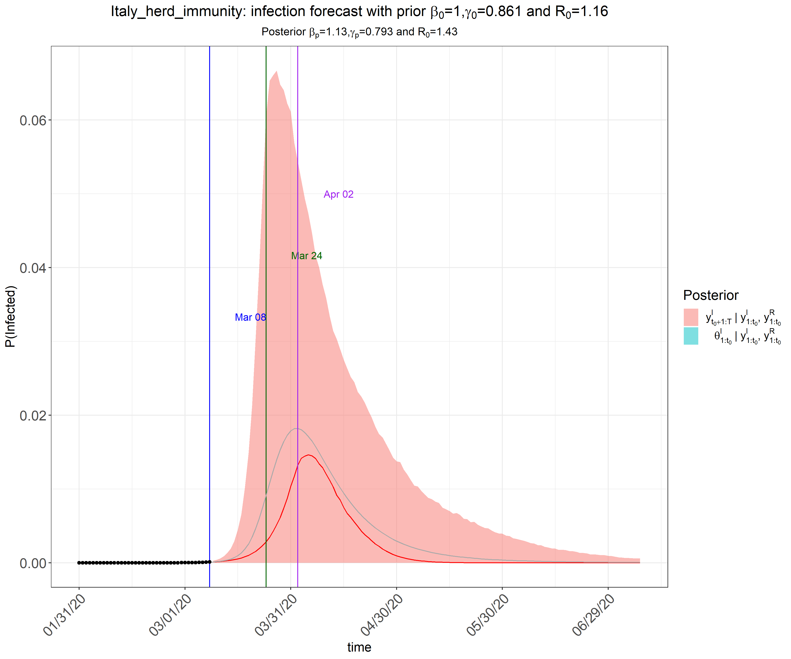
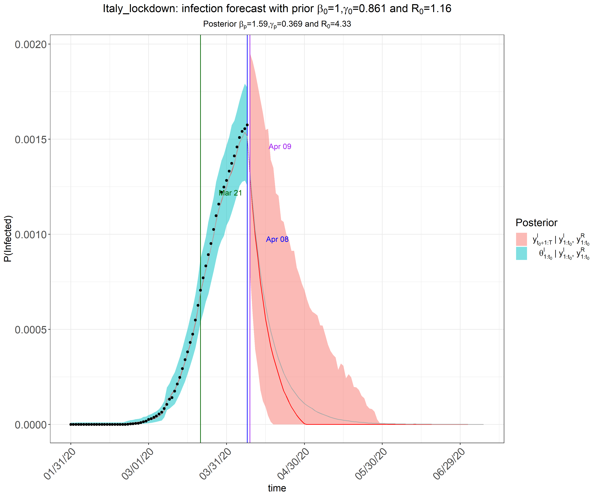
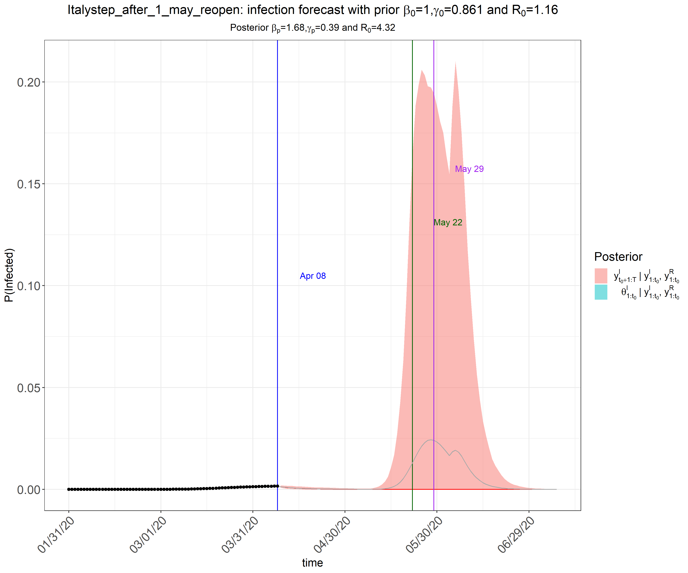
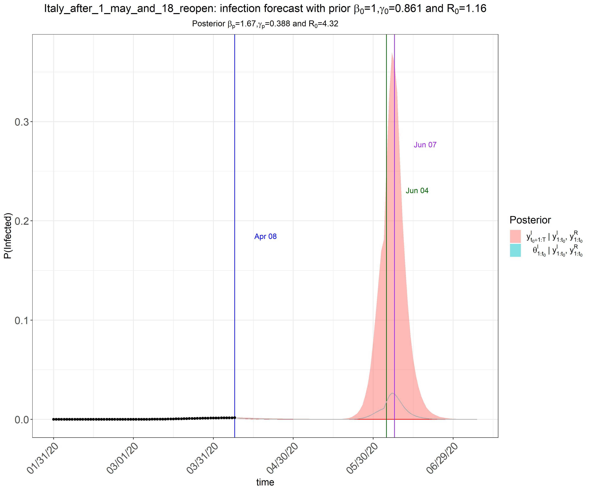
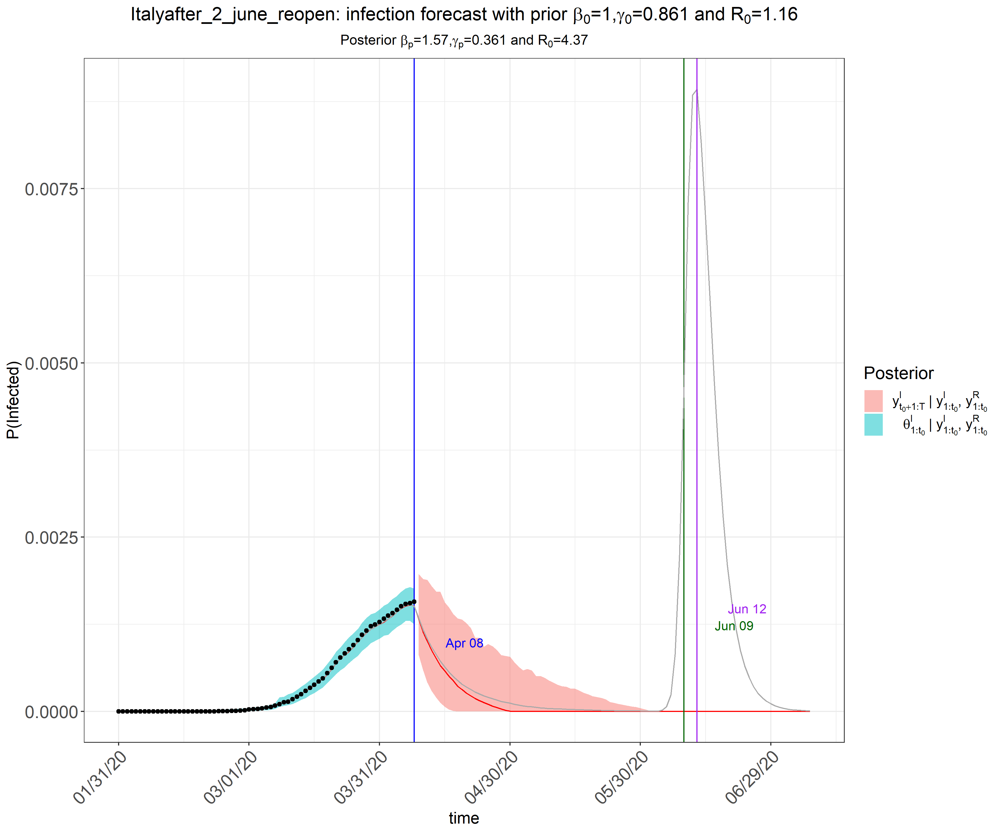
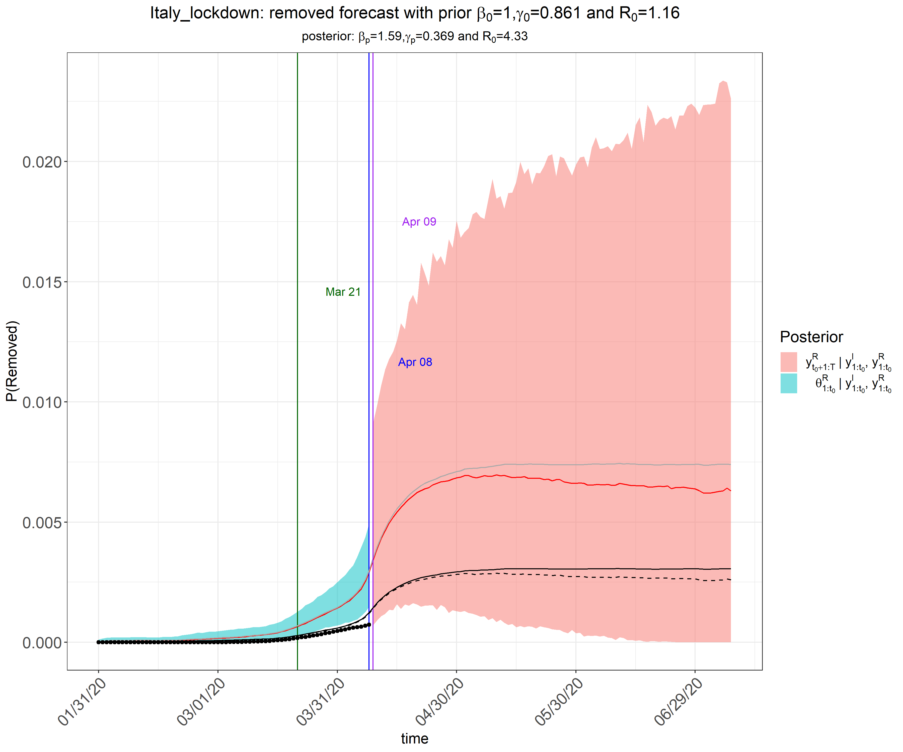

Covid-19 in Italy - scenarios based on extended state-space SIR epidemiological models
================

2020-04-05 by [Enrico Papalini](https://www.linkedin.com/in/enricopapalini/)

A [printable version](Article.pdf) of this article, updated to 4 April 2020. On this repository results are updated daily at about 19:00 CEST.

Introduction
-------

The outbreak of novel Corona Virus disease (a.k.a. COVID-19), originated in Wuhan, the capital of Hubei Province spreads quickly all over the World and affects Italy starting from the end of January 2020. The Italian government has enforced very stringent quarantine and inspection to prevent the worsening spread of COVID-19. 

Using software published by [Song Lab](http://www.umich.edu/~songlab/), we create a set of models that explicitly account for the time-varying quarantine protocols, during both the phases of the lock down and the reopening of Italian nation. 

Song Lab has extended the classical SIR model for infectious disease by incorporating forms of medical isolation (in-home quarantine and hospitalization) in the underlying infectious disease dynamic system, using the state-space model for both daily infected and hospitalized incidences and MCMC algorithms.

The standard SIR model has three components: susceptible, infected, and removed (including the recovery and dead). 

By introducing a time-dependent
*π*(*t*)∈\[0, 1\]
 function that modifies the transmission rate
*β*
, we can depict a series of time-varying changes caused by either external variations like government policies, protective measures and environment changes, or internal variations like mutations and evolutions of the pathogen.

The function *π*(*t*) has been set stepwise trying to model the impacts of gradual lockdown strategy:
- 21 February 2020: The first lockdowns began covering eleven municipalities and affecting around 50,000 people; schools in some Northern regions of Italy have been shut down too.
- 8 March 2020: The quarantine zone has been expanded to cover much of northern Italy, affecting over sixteen million people, restricting travel from, to or within the affected areas, banning funerals and cultural events, and requiring people to keep at least one metre of distance from one another in public locations such as restaurants, churches and supermarkets.
- 10 March 2020: The quarantine zone has been expanded to cover all the nation. The lockdown has started here.
- 21 March 2020: A further enlargement of the lockdown has been announced, by shutting down all non-necessary businesses and industries.
- 13 April 2020: The lockdown is due to end.

We model this the impact of these measures on the transmission rate in this way (values of *π*(*t*) over the time):

In the following sections, we will show the results of the extended state-space SIR models applied to the Italian scenarios. 

PELASE NOTE: **The results provided below are based on relatively short chains.** According to our experience, this setting (`M=5e3` and `nburnin=2e3`) should provide acceptable results in terms of the trend and turning points estimation, **the estimation of parameters and their credible intervals might not be accurate**. Hence, if possible, we would recommend using `M=5e5` and `nburnin=2e5` to obtain stable MCMC chains via [`rjags`](https://cran.r-project.org/web/packages/rjags/index.html).

The herd immunity scenario for Italy
-------

At the very beginning of the spread, while mainland Europe was shutting down schools and imposing strict quarantines, the United Kingdom had taken a different approach to combating the coronavirus pandemic: Its government experts said the virus will be defeated only once most of the population gets infected and builds up immunity to it: it’s called “herd immunity”. Let's try to apply this scenario on Italy to see how the COVID-19 would have evolved if no lock down strategy had been set up: about 2% of Italian population should be infected by the end of March (about 1.200.000‬ people).

The actual national lock down scenario for Italy
-------

The lockdown measures have lowered the number of infected people to about 0,2% of Italian population (about 120.000 people) and mantaining over the time can remove completely the COVID-19 from Italy by the end of May 2020.

Re-opening Italy after Easter
-------

If Italy were fully reopened after 13 April 2020, the number of infected people should be high and the COVID-19 spread would restart, having a peak at 15 May 2020 and infecting about 12% of Italians (about 7,2M people).

Re-opening Italy after First of May
-------

If Italy were fully reopened after First of May 2020, the number of infected people should be lower but not enough to avoid the COVID-19 spread to restart, having a relatively small peak at 6 June 2020 and infecting about 2% of Italians.

Re-opening Italy after 18 of May 
-------

On 7 April, italian news papers reported rumors about a possible gradual reopening starting from 4 or 8 of May (only major italian factories) and continuining on 18 of May for schools. Modelling this reopenoning with *π*(*t*) as reverse step function rising from 0.2 to 1 drirng May, we discover that also this scenario will open italy to early to avoid a new COVID-19 spread.

Re-opening Italy after Second of June
-------

Second of June is Italian national day and we take this as possible date for a full restart of Italy. In this scenario the waste majority of italians would be not infected by the end of May, having a safe restart without any major peak.

How many lives have been saved since the lockdown
-------

In order to try to estimate the positive effect of the current lockdown strategy, we compared the recovered + deaths graphs in the first (no lockdown) and the second (actual lock down) scenarios. The thiny black line shows the number of deaths in these two simulations. A scenario with no lockdown could cause the dead of about 18% of Italian population, instead the current lock down could reduce this figure to 0,25%. We strongly hope this model is wrong because 0,25% means about 150.000 deaths!

Final remarks: #STAYATHOME
-------

Our study suggests to continue to stay completely quarantined until end of May in order to avoid the COVID-19 spread. Italian people will be making genuine sacrifices staying lock down for about three months but this is the only solution our models suggest. We hope for the rapid discovery of a vaccine that can change this scenario but it is unrealistic to happen within three months.

The graphs on this article have been calculated based on Italian Protezione Civile data until 4 April 2020. Graphs will be regularly updated when new data are available running the [code in the repository](R/covid-19.R).

On 6 April Peter Song was glad someone from Italy was using his R library and Lili Wang confirmed my model:
>Hi Enrico,

>Your analyses look good to me! I personally a lot of information in your manuscript. Thank you for sharing this with us. It is definitely okay to increase the transmission rate modifier back. I did some analysis to forecast how stringent and how long the strict control needs to last in China to avoid a second outbreak, which is similar to what you have done here. I want to share with you two graphs I did for Italy. Note that I used the cluster so I ran the MCMC chain for longer, which might cause some difference with the results you were sharing on the GitHub. The shorter chain would make the analysis more sensitive to the priors you set. The conclusion from my analysis was that the lockdown and keep social distance in Italy has been taking effect! The increase in cases started to slow down two weeks ago.

> I was so moved by many recent video shot for Italian musicians' performances on their balconies. As a story said that music cannot be quarantined. I hope people in Italy can get over it soon, so as everybody on the earth. Please let me if you have further questions. 

>Take care and stay safe!

>Best,
Lili

### A special thanks to 
1. Song, P. X., Wang, L., Zhou, Y., He, J., Zhu, B., Wang, F., ... & Eisenberg, M. (2020). An epidemiological forecast model and software assessing interventions on COVID-19 epidemic in China. medRxiv.

2. [Learning Machine blog](https://blog.ephorie.de/epidemiology-how-contagious-is-novel-coronavirus-2019-ncov)

# R resources about COVID-19 spread
* [covid-19.R](R/covid-19.R) - a collection of graphs, inspired by [Corona in Belgium](http://www.bnosac.be/index.php/blog/97-corona-in-belgium) with the addition of previsional model made by Facebook Prophet, [SIR plain model](https://blog.ephorie.de/covid-19-the-case-of-germany) and [SIR with variable transmission rate](https://github.com/lilywang1988/eSIR) implemented by eSIR library.
* [covid_ggplo2.R](R/covid_ggplo2.R) - a smaller collection of graphs, but nicer to display, made by [Kieran Healy](https://kieranhealy.org/blog/archives/2020/03/21/covid-19-tracking/)
* [epilocal.R](R/epilocal.R) - [Italian epilocal model](https://arxiv.org/pdf/2003.07928) made by Bonetti with the addition of end day predition, ispired by [EIEF COVID-19 Forum](https://www.dropbox.com/s/n7pyjvhilpc3ooj/Covid19_descriptive%20stats_30.pdf?raw=1) - this approach to calculate the end of the covid-19 spread has not  any scientifical accurancy.

# Other resources in this repository

* [covid_19_prediction_for_italy.ipynb](https://colab.research.google.com/drive/1K7FltVfGAnnMRmnp4F430gmgNkmaGgO9)
  - Notebook related to Covid-19 emergency in Italy, ispired by the work  [COVID-19 data with SIR model](https://www.kaggle.com/lisphilar/covid-19-data-with-sir-model) made by [lisphilar](https://www.kaggle.com/lisphilar) on kaggle.